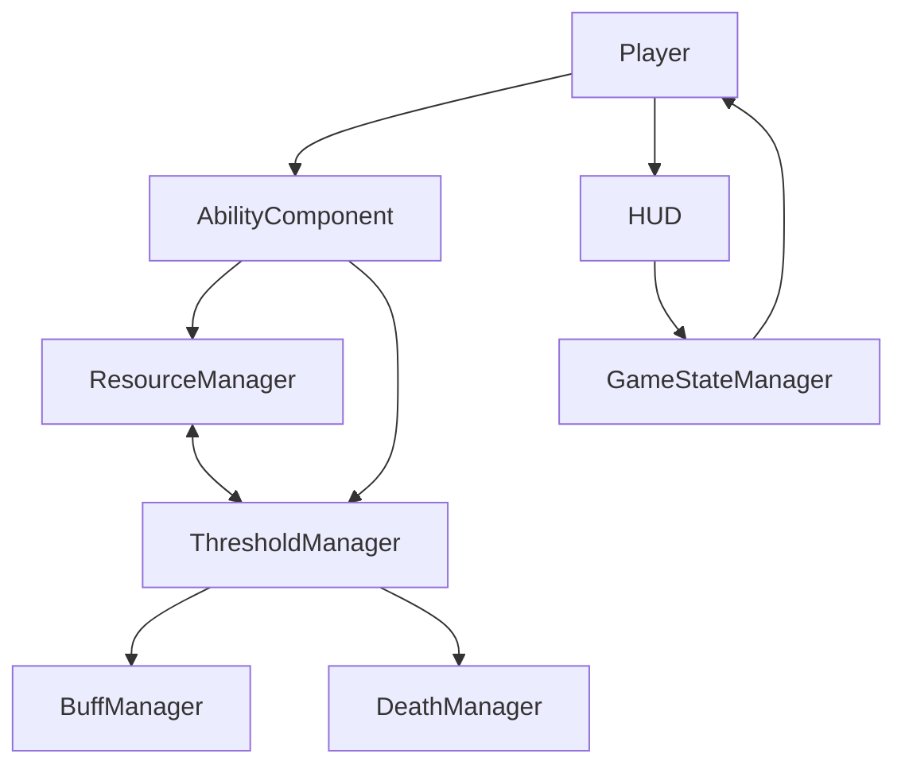

# Blackhole Project - Comprehensive Code Analysis Report

**Analysis Date**: 2025-07-12  
**Engine Version**: Unreal Engine 5.5  
**Project Type**: C++ Action Game with Blueprint Integration  
**Analyzer**: Claude Assistant

## Executive Summary

This report presents a comprehensive analysis of the Blackhole project codebase, examining system architecture, code quality, UE5.5 compliance, and potential issues. The project demonstrates good understanding of Unreal Engine patterns but has several areas requiring attention for production readiness.

### Overall Health Score: 7.5/10

**Strengths**:
- Clean component-based architecture
- Proper use of UE5 subsystems
- Good delegate implementation patterns
- Excellent data-driven design (ComboDataAsset)

**Critical Issues**:
- Missing input binding causing menu system failure
- Memory management risks with raw pointers
- Incorrect GameMode class initialization
- AI system not following UE5 best practices

## 1. Architecture Analysis

### 1.1 System Dependencies



**Issues Found**:
- Circular dependency between ResourceManager and ThresholdManager
- Tight coupling between Player, HUD, and GameStateManager
- Multiple systems accessing player abilities independently

### 1.2 Subsystem Implementation

| Subsystem | Type | Implementation Quality | Issues |
|-----------|------|----------------------|---------|
| ResourceManager | GameInstance | ✅ Good | Excessive logging |
| ThresholdManager | World | ⚠️ Fair | Should be split further |
| BuffManager | World | ✅ Excellent | None |
| DeathManager | World | ✅ Excellent | None |
| ComboDetectionSubsystem | World | ✅ Good | Memory leak risk |
| ObjectPoolSubsystem | World | ⚠️ Fair | Raw pointer storage |
| GameStateManager | GameInstance | ✅ Good | None |
| HitStopManager | World | ✅ Excellent | None |

## 2. Critical Issues

### 2.1 Missing Input Binding (HIGH PRIORITY)

**File**: `BlackholePlayerCharacter.cpp`  
**Issue**: MenuToggleAction is never bound in SetupPlayerInputComponent()  
**Impact**: Menu system is non-functional  
**Fix Required**:
```cpp
// Add in SetupPlayerInputComponent()
if (MenuToggleAction)
{
    EnhancedInputComponent->BindAction(MenuToggleAction, ETriggerEvent::Triggered, this, &ABlackholePlayerCharacter::ToggleMenu);
}
```

### 2.2 Memory Management Risks

**ObjectPoolSubsystem**:
- Stores raw `AActor*` pointers without UPROPERTY
- No validation before reuse
- Risk of dangling pointers

**ComboDetectionSubsystem**:
- `TMap<AActor*, FComboState>` never cleaned when actors destroy
- Potential memory leak

**ThresholdManager**:
- Stores ability component pointers without proper cleanup timing

### 2.3 GameMode Initialization Error

**File**: `BlackholeGameMode.cpp`  
**Issue**: Using StaticClass() in constructor  
**Current**:
```cpp
DefaultPawnClass = ABlackholePlayerCharacter::StaticClass();
```
**Should be**: Use TSubclassOf<> with EditDefaultsOnly properties

## 3. Code Quality Issues

### 3.1 Include Pattern Problems

**Relative Path Include**:
- File: `HackableObject.h`
- Line 5: `#include "../Components/Interaction/HackableComponent.h"`
- Should use: `#include "Components/Interaction/HackableComponent.h"`

### 3.2 Resource System Confusion

**Conceptual Issue**: WP (Willpower) costs are being ADDED instead of consumed
- This is intentional for the corruption mechanic but poorly documented
- Interface says "ConsumeResources" but implementation adds resources
- Recommendation: Rename to "CorruptWithWP" or add clear documentation

### 3.3 Code Duplication

**Enemy System**: All enemy types duplicate these methods:
- `BeginPlay()`
- `MoveTowardsTarget()`
- `GetDistanceToTarget()`
- `TryAttack()`

**Ability System**: Resource validation and world retrieval code duplicated across all abilities

## 4. UE5.5 Best Practices Violations

### 4.1 AI System Architecture

**Current Issues**:
- No AI Controllers - all logic in Actor classes
- No Behavior Trees or Blackboards
- Simple timer-based state updates
- Hardcoded AI behaviors in C++

**UE5 Best Practice**: Use AIController + Behavior Trees

### 4.2 Missing UE5 Features

| Feature | Status | Impact |
|---------|--------|--------|
| Gameplay Tags | Module included but unused | Missing ability categorization |
| World Partition | Not implemented | N/A for small levels |
| Mass Entity | Not used | Could optimize many enemies |
| Replication | No setup | Required for multiplayer |
| Data Validation | Only in ComboDataAsset | Should be everywhere |

### 4.3 Property Metadata

Missing helpful metadata:
- No ClampMin/ClampMax on numeric properties
- No DisplayName/ToolTip for better UX
- No UIMin/UIMax for sliders

## 5. Performance Concerns

### 5.1 HUD Drawing

**Issue**: DrawHUD() performs extensive operations every frame
- String formatting every frame
- Multiple ability iterations
- No dirty flag system

**Recommendation**: Cache calculations, use dirty flags

### 5.2 AI Updates

**Issue**: All enemies update at same rate regardless of distance
- Every enemy does LineTrace checks
- No LOD system for AI

**Recommendation**: Distance-based update rates

### 5.3 Tick Optimization

**Good**: AbilityComponent only ticks when on cooldown  
**Bad**: ComboAbilityComponent always ticks for time slow management

## 6. Architectural Improvements Needed

### 6.1 Input Management
Create centralized input state manager to handle:
- Input mode switching (UI/Game)
- Input validation during transitions
- Consistent input handling

### 6.2 Widget Lifecycle
Current issues:
- Widgets nullified but not properly destroyed
- Uses MarkAsGarbage() inappropriately
- No centralized widget factory

### 6.3 Buff System Consolidation
- ThresholdManager has FSurvivorBuff
- BuffManager has FCombatBuff
- Should consolidate into single system

## 7. Specific Recommendations

### 7.1 Immediate Fixes (Priority 1)
1. **Add missing MenuToggleAction binding**
2. **Fix GameMode class initialization**
3. **Fix relative include path in HackableObject.h**
4. **Add UPROPERTY to stored pointers in ObjectPoolSubsystem**
5. **Implement cleanup for ComboDetectionSubsystem map**

### 7.2 Short-term Improvements (Priority 2)
1. **Document WP corruption mechanic clearly**
2. **Extract common enemy code to base class**
3. **Implement proper widget cleanup**
4. **Add validation to prevent null pointer access**
5. **Reduce HUD drawing overhead**

### 7.3 Long-term Refactoring (Priority 3)
1. **Implement AI Controllers and Behavior Trees**
2. **Add Gameplay Tag system for abilities**
3. **Create LOD system for AI updates**
4. **Implement replication for multiplayer**
5. **Add comprehensive data validation**

## 8. Positive Findings

### 8.1 Excellent Patterns
- **Subsystem Usage**: Proper lifecycle management
- **Delegate Implementation**: Clean event system
- **Data Assets**: ComboDataAsset is exemplary
- **Interface Design**: IResourceConsumer well-designed
- **Configuration**: GameplayConfig.h centralizes constants

### 8.2 Good Practices
- Extensive null checking
- Proper use of forward declarations
- Good separation of concerns
- Blueprint-friendly architecture
- Performance-conscious ability ticking

## 9. Testing Recommendations

### 9.1 Memory Testing
- Test ObjectPoolSubsystem with rapid spawn/despawn
- Verify ComboDetectionSubsystem cleanup on level transitions
- Check for widget leaks during menu transitions

### 9.2 Edge Cases
- Test death during ability execution
- Test menu toggle during combat
- Test ultimate mode with all abilities disabled
- Test AI with 50+ enemies

## 10. Conclusion

The Blackhole project demonstrates solid understanding of Unreal Engine patterns and good architectural decisions. However, several critical issues need immediate attention:

1. **Fix the menu input binding** - System is broken without it
2. **Address memory management risks** - Prevent crashes
3. **Fix GameMode initialization** - Follow UE5 patterns
4. **Refactor AI system** - Current implementation doesn't scale

With these fixes, the project would improve from 7.5/10 to 9/10 quality.

### Next Steps
1. Apply Priority 1 fixes immediately
2. Plan Priority 2 improvements for next sprint
3. Consider Priority 3 refactoring for production readiness

The codebase is well-organized and maintainable, requiring mostly tactical fixes rather than strategic rewrites. The team has built a solid foundation that can be enhanced to production quality with focused effort on the identified issues.